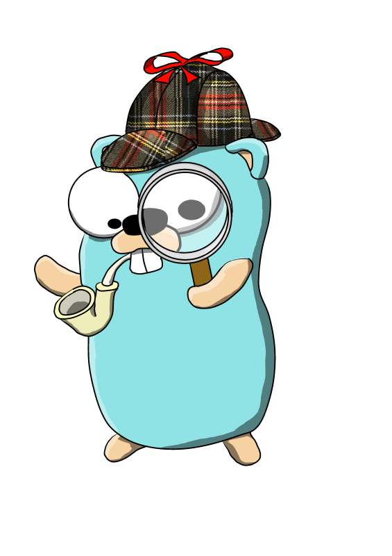

# GO DETECTIVE

## Simple project for encrypting and decrypting data with Go's ready-made packages.

[@Telecoda](https://twitter.com/telecoda?lang=en)
https://github.com/telecoda/inktober-2016

### Encryption made using:

[x] SHA256 Secure Hashing Algorithm 2

[x] Advanced Encryption Standard

[x] Galois/Counter Mode of Operation

